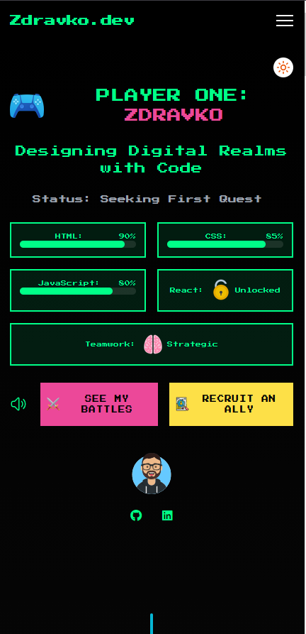
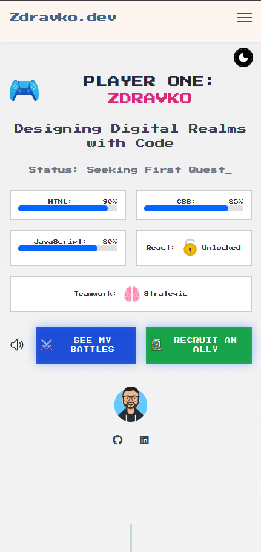
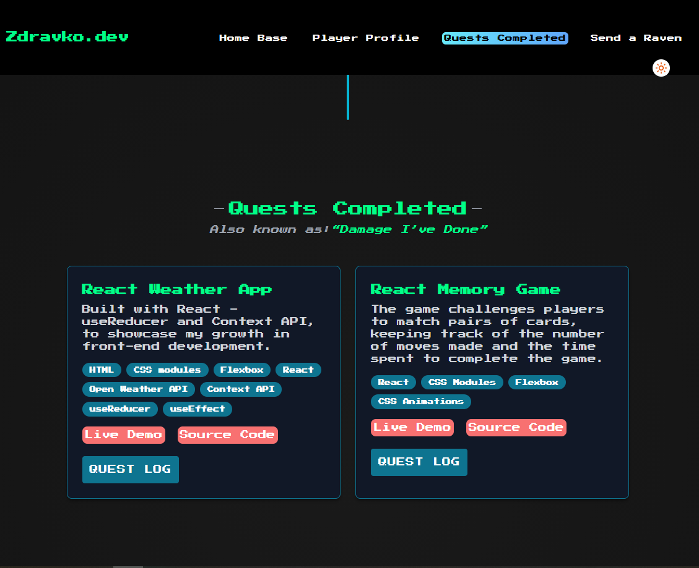
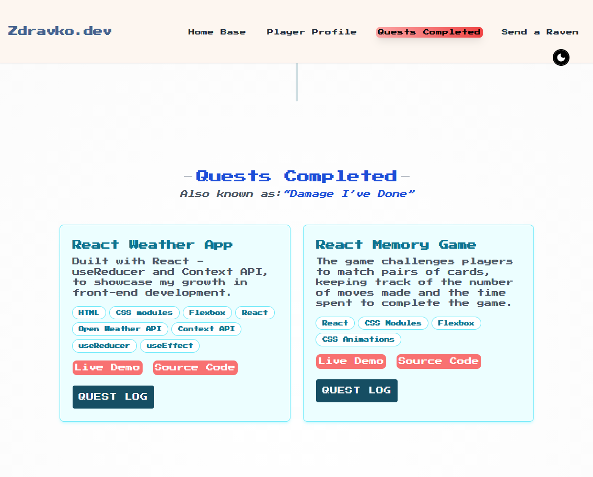

# React Portfolio

A personal portfolio website built with React to showcase my projects, skills, and experience. Designed to be fully responsive and visually engaging, it highlights my work and provides a way to contact me directly.

I'm an aspiring **front-end developer** passionate about **building clean**, **user-friendly** web interfaces and **continuously improving** my skills.

---

## 🌐 Live Demo

Check out the live site here:  
[React Portfolio Live Demo](https://Zdravko93.github.io/react_portfolio)

---

## 📸 Screenshots






---

## ⚡ Features

- Responsive design for mobile, tablet, and desktop screens
- Projects showcase with live links and descriptions
- Skills section highlighting technologies I work with
- Contact form for direct inquiries
- Built using modern React practices

---

## 🛠️ Technologies Used

- React
- JavaScript (ES6+)
- HTML5
- Tailwind
- Git & GitHub for version control
- GitHub Pages for deployment

---

## 💻 Installation & Local Setup

If you want to run this project locally, follow these steps:

1. **Clone the repository**

```bash
git clone https://github.com/Zdravko93/react_portfolio.git
```

2. **Navigate into the project directory**

```bash
cd react_portfolio
```

3. **Install dependencies**

```bash
   npm install
```

4. **Start the development server**

```bash
   npm start
```

The app will run on http://localhost:3000

## 🚀 Deployment

This portfolio is deployed using **GitHub Pages**:

```bash
npm run build
npm run deploy
```

Live demo is available at: https://Zdravko93.github.io/react_portfolio

#### 📫 Contact

Created by **Zdravko93** – feel free to reach out!

- LinkedIn: [https://www.linkedin.com/in/zdravkodelic/](https://www.linkedin.com/in/zdravkodelic/)
- Frontend Mentor: [https://www.frontendmentor.io/profile/Zdravko93](https://www.frontendmentor.io/profile/Zdravko93)
- GitHub: [https://github.com/Zdravko93](https://github.com/Zdravko93)

⭐ If you like this project, consider giving it a star — it helps me grow as a developer!
